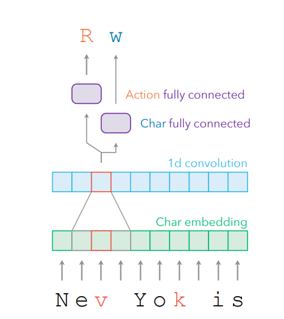
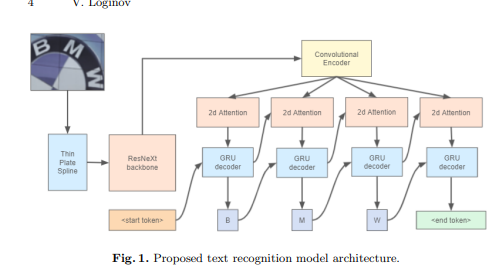

# なにこれ
AIOCRの技術について、まぁなんかbounding box決めてCNNとかtransformerでなんかやるんだろうなぁ、くらいの理解しかなかったので勉強スタート

# OCRの後処理について
OCR単体での精度はあまり良くないので後処理としてOCRの結果をNNで直すタスクがあるらしい。

読んだ論文：http://arxiv.org/abs/2108.02899v1 (Document Intelligence Workshop at KDD, 2021)

文字のembeddingを作ってそれを1d convに入れて、その出力を2種類の全結合層にぶち込む。
1. 片方はInsert, Replace, Insert_Space, Delete, None, Paddingの6クラス分類を解く。
2. もう片方は何の文字をInsert（Replace）するかを予測するモデル。
lossはハイパーパラメータ $\alpha,\beta$ を用いて $L = \alpha * L_{action} + \beta * L_{character}$ とする。

## まなび
後処理は大事。出力二つに分けるのはなるほどな。著者曰く「個別に予測することで語彙サイズとラベルのスパースさを抑えられる。日本語や中国語のような文字数が多い言語で効く。」とのこと。

## わかってないこと
NoneとかDeleteとかの時のcharacterのlossってどうするんだろ。無視？

# Scene Text Recognition
風景に潜む文字列を抽出するタスク。具体的には曲がって並んでいるような文字列の検知。書類を扱う我々には直接は関係ない。

読んだ論文：https://arxiv.org/abs/2107.13938v1

うーんまずい。雰囲気は分かるけどちょっとあんま完全には理解してない。
1. Thin Plate Spline(薄板スプライン変換)：　ちょっと詳しくは見てないが、スプライン変換の多変量版ということが分かった。要は画像のRGBを平滑化して滑らかにしたい。
2. ResNeXt: あんまり分かってないけどResNet系の進化版かな。また詳しく調べる。
3. Convolutional Encoder: 2d convでなんか適当に情報取るっぽい。何層かまでは論文に書いてなかったので分からん。入力1024 channelで特徴マップが3 $\times$ 12 なことは分かった。
4. 2d attention: 2d attention種類多すぎて追いきれなかった。要勉強
5. GRU: attentionの結果をGRU突っ込んで前の状態から次の状態（文字）を予測する、終わり。

## まなび
もともとtransformation（曲がってる文字列をまっすぐになるように変形する操作）が必要だったけど学習データ膨大なら要らなくね？というのが論文の主張。なお日本語はデータが少ないので無理な模様。

モデルアーキテクチャの一例を知った。CNN backbone + Encoder + Decoderの流れが一般的っぽいか？

薄板スプライン変換が結構大事っぽい。

## わかってないこと
2d attentionの歴史。

# 次の課題
1. 日本語のデータセットどうするのか
2. 日本語or中国語のOCRについて調査
3. なんか適当に動かしてみる